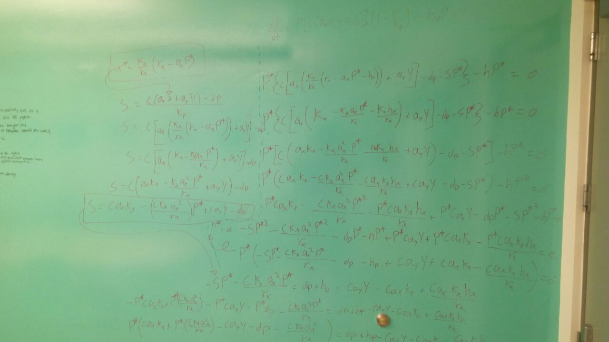

```{r setup, include=FALSE}
knitr::opts_chunk$set(echo = TRUE)

suppressPackageStartupMessages({
  library(deSolve)
  library(cowplot)
  library(zeallot)
  library(tidyverse)
})
```

# Description of the system

Fishing effort tends to focus on large-bodied, slow-growing, late-maturing organisms, often at high trophic levels. As abundances of these organisms decrease, fishing effort then focuses on lower trophic level species, gradually moving through the food webs in a  process called "trophic downgrading" or "fishing down the food webs" [@pauly_1998]. When fisheries are to be recovered, it is important to take into account the order in which predator and preys are managed, as their interspecific interactions can shape the pathway of recovery. Here I recreate the results by @samhouri_2017, who investigates the pathways of recovery of a harvested predator-prey system under different managemen tinterventions.

# Description of the model

The harvested system of a generalist predator and a prey is given by:

\begin{equation}
\label{eq:prey}
\frac{dX}{dt} = r_xX\left(1-\frac{X}{K_x}\right)-a_xPX-h_xX \\
\end{equation}

\begin{equation}
\label{eq:pred}
\frac{dP}{dt} = [c(a_xX+a_yY)-d_P]P\left(1-\frac{P}{K_p}\right)-h_pP
\end{equation}

Where $X$ and $P$ represent the prey and predator abundances, $r_x$ is the preys per capita growth rate, and $K_x$ and $K_p$ are the carrying capacity of prey and predator. Prey are substracted from the population due to the interaction between species -governed by $a_x$-, and harvesting $h_x$. Predators feed on $X$ and $Y$ at rates $a_x$ and $a_y$, die at rate $d_p$ and are harvested at rate $h_p$. Preys are converted to predators with a conversion rate $c$. Parameter values obtained from @samhouri_2017 and are presented in table 1.

```{r, echo = F}
rx <- 1
Kx <- 100
ax <- 0.03
hx <- 0.65
c <- 0.05
ay <- 0.03
dp <- 0.25
Kp <- 25
hp <- 0.325

data.frame(parameter = c("rx", "Kx", "ax", "hx", "c", "ay", "dp", "Kp", "hp"),
           value = c(rx, Kx, ax, hx, c, ay, dp, Kp, hp)) %>% 
  knitr::kable(digits = 3, format = "latex", caption = "Parameter values for the harvested system of a generalist predator and a prey.", booktabs = T) %>% 
  kableExtra::kable_styling(latex_options = "HOLD_position")
```

\clearpage

# Approaches

## Calculating equilibrium solutions analytically

We set \ref{eq:prey} equals to zero and replace $X$ with $X^*$ for to denote equilibrium densities:

$$
\begin{split}
r_xX^*\left(1-\frac{X^*}{K_x}\right)-a_xPX^*-h_xX^* &= 0 \\
r_xX^*-\frac{r_xX^{*2}}{K_x}-a_xPX^*-h_xX^* &= 0 \\
X^*\left(r_x-\frac{r_xX^*}{K_x}-a_xP-h_x\right) &= 0 \\
\end{split}
$$

At this point, a trivial equilibrium is that $X^* = 0$. Continuing to solve for $X^*$:

\begin{equation}
\begin{split}
\label{eq:prey_e}
r_x-\frac{r_xX^*}{K_x}-a_xP-h_x &= 0 \\
-\frac{r_xX^*}{K_x} &= -r_x+a_xP+h_x \\
\frac{r_xX^*}{K_x} &= r_x-a_xP-h_x \\
X^* &= \frac{K_x}{r_x}(r_x-a_xP-h_x)
\end{split}
\end{equation}

For the predator equation, the density-dependence can be expressed as $S = \frac{c(a_xX + a_yY)-dp}{Kp}$. By substituting this into the predator equation (\ref{eq:pred}) can be rewritten as:

$$
\frac{dP}{dt} = P[c(a_xX+a_yY)-d_P-SP]-h_pP
$$

This can be set equal to zero, and $P$ substituted for $P^*$ to denote equilibrium:

$$
P^*\left[c(a_xX+a_yY)-d_P-SP^*\right]-h_pP^* = 0
$$

Substituting \ref{eq:prey_e} into the equation above, we obtain:

$$
P^*\left[c\left(a_x\left(\frac{K_x}{r_x}(r_x-a_xP-h_x)\right)+a_yY\right)-d_P-SP^*\right]-h_pP^* = 0 
$$

Turns out solving for $P^*$ here is quite hard (the authors did it in Mathematica). I was only able to get to[^1]:

$$
\begin{split}
P^*\left(-S - \frac{cK_xa_x^2}{r_x}\right) &= d_p + h_p + c\left(\frac{a_xK_x}{r_x} - a_yY - a_xK_x\right) \\
P^* &= \frac{d_p + h_p + c\left(\frac{a_xK_x}{r_x} - a_yY - a_xK_x\right)}{\left(-S - \frac{cK_xa_x^2}{r_x}\right)}
\end{split}
$$

Substituting $S$ gives:

$$
P^* = \frac{d_p + h_p + c\left(\frac{a_xK_x}{r_x} - a_yY - a_xK_x\right)}{\left(-\frac{c(a_xX^* + a_yY)-dp}{Kp} - \frac{cK_xa_x^2}{r_x}\right)}
$$

And substituting $X^*$ into the above, gives:

$$
P^* = \frac{d_p + h_p + c\left(\frac{a_xK_x}{r_x} - a_yY - a_xK_x\right)}{\left(-\frac{c(a_x\left(\frac{K_x}{r_x}(r_x-a_xP^*-h_x)\right) + a_yY)-dp}{Kp} - \frac{cK_xa_x^2}{r_x}\right)}
$$

[^1]: See the math attempt section.

## Different management strategies

I reproduce the three managemen strategies proposed by @samhouri_2017. All strategies follow the same initial path: The system is let to run until equilibrium, then trophic downgrading occurs b fishing for the predator only until a new equilibrium is reached. Then, harvest of prey begins until a new harvested equilibrium is reached. The next steps depend on the management strategy:

a. Harvest of both species stops (*i.e.* $h_x = h_p = 0$)
b. Harvest of predator stops (*i.e.* $h_p = 0$) until new eqilibrium is reached, and then harvest of prey stops (*i.e.* $h_x = 0$)
c. Harvest of prey stops (*i.e.* $h_x = 0$) until new eqilibrium is reached, and then harvest of predator stops (*i.e.* $h_p = 0$)

For that, I define a function to call with `lsoda` multiple times:

```{r}
pred_prey <- function(t, values, pars){
  
  # Extract parameters
  rx <- pars[1]
  Kx <- pars[2]
  ax <- pars[3]
  hx <- pars[4]
  c <- pars[5]
  ay <- pars[6]
  dp <- pars[7]
  Kp <- pars[8]
  hp <- pars[9]
  
  Y <- 500
  
  # Extract state variables
  X <- values[1]
  P <- values[2]

  # Update equations
  
  dXdt <- (rx*X)*(1-(X/Kx))-(ax*P*X)-(hx*X)
  dPdt <- P*((c*((ax*X)+(ay*Y)))-dp)*(1-(P/Kp))-(hp*P)
  
  return(list(c(dXdt, dPdt)))
}
```

I also create a wrapper function that allows me to manipulate all the parameters, calls `lsoda` and returns a `data.frame` object.

```{r}
run_model <- function(rx = 1, Kx = 100, ax = 0.03, hx = 0.65,
                      c = 0.05, ay = 0.03, dp = 0.25, Kp = 25,
                      hp = 0.325, t0 = 0, t1 = 40, X0, P0){
  # Define parameters
  pars <- c(rx, Kx, ax, hx, c, ay, dp, Kp, hp)
  
  # Define values
  values <- c(X0, P0)
  
  # Define time
  time <- seq(t0, t1, by = 0.1)
  
  lsoda(y = values, times = time, func = pred_prey, parms = pars) %>% 
    as.data.frame() %>% 
    magrittr::set_colnames(value = c("Time", "X", "P")) %>%
    gather(Organism, Abundance, X, P) %>%
    mutate(H = case_when(Organism == "X" ~ hx*Abundance,
                         Organism == "P" ~ hp*Abundance))
}
```

Since the initial conditions of every scenario depend on the previous scenario's final conditions, I create a function that extracts the last values of $X$ and $Y$.

```{r}
extract_state_vars <- function(scenario){ 
  last_values <- scenario %>% 
    filter(Time == max(Time)) %>% 
    group_by(Organism) %>% 
    select(-H) %>% 
    spread(Organism, Abundance)
  
  return(c(last_values$X, last_values$P))
  }
```

### Run model to equilibrium trophic downgrading, and harvest for prey

```{r}
# First call of the model to reach equilibrium
start <- run_model(hx = 0, hp = 0, t1 = 30, X0 = 25, P0 = 25)

# Extract final conditions and start trophic downgrading
c(X1, P1) %<-% extract_state_vars(start)
harvest_P <- run_model(hx = 0, t0 = 30, t1 = 70, X0 = X1, P0 = P1)

# Extract final conditions and start fishing for prey too
c(X2, P2) %<-% extract_state_vars(harvest_P)
harvest_X <- run_model(t0 = 70, t1 = 120, X0 = X2, P0 = P2)
```

\clearpage

#### Synchronous recovery

```{r}
# Stop fishing and let both species recover
c(X3, P3) %<-% extract_state_vars(harvest_X)
stop_harvest <- run_model(hx = 0, hp = 0, t0 = 120, t1 = 200, X0 = X3, P0 = P3)

# create ggplot object
both <- rbind(start, harvest_P, harvest_X, stop_harvest) %>% 
  ggplot(aes(x = Time, y = Abundance)) +
  geom_line(aes(color = Organism), size = 1) +
  scale_color_brewer(palette = "Set1") +
  theme(legend.position = "none")
```

#### Predator first

```{r}
# Start recovering predator
c(X3, P3) %<-% extract_state_vars(harvest_X)
stop_harvest_P <- run_model(hp = 0, t0 = 120, t1 = 140, X0 = X3, P0 = P3)

# Start recovering prey
c(X4, P4) %<-% extract_state_vars(stop_harvest_P)
stop_harvest_X <- run_model(hx = 0, hp = 0, t0 = 140, t1 = 200, X0 = X4, P0 = P4)

p_first <- rbind(start, harvest_P, harvest_X, stop_harvest_P, stop_harvest_X) %>% 
  ggplot(aes(x = Time, y = Abundance)) +
  geom_line(aes(color = Organism), size = 1) +
  scale_color_brewer(palette = "Set1") +
  theme(legend.position = "none")
```

#### Prey first

```{r}
# start recovering prey
c(X3, P3) %<-% extract_state_vars(harvest_X)
stop_harvest_X <- run_model(hx = 0, t0 = 120, t1 = 140, X0 = X3, P0 = P3)

# Start recovering predator
c(X4, P4) %<-% extract_state_vars(stop_harvest_X)
stop_harvest_P <- run_model(hp = 0, hx = 0, t0 = 140, t1 = 200, X0 = X4, P0 = P4)

x_first <- rbind(start, harvest_P, harvest_X, stop_harvest_X, stop_harvest_P) %>% 
  ggplot(aes(x = Time, y = Abundance)) +
  geom_line(aes(color = Organism), size = 1) +
  scale_color_brewer(palette = "Set1") +
  theme(legend.position = "none")
```


```{r, fig.height = 8, fig.width = 6, fig.cap = "Different recovery scenarios after trophic downgrading for a generalist predator and one of its prey. Red lines indicate predator, blue lines indicate prey. Vertical dashed lines indicate when conditions change. The scenarios include synchronous recovery of predator and prey (A), recovery of predator first (B) and recovery of prey first (C)."}
plot_grid(both, p_first, x_first, labels = "AUTO", ncol = 1) +
  geom_vline(xintercept = c(0.27, 0.425, 0.625, 0.7), linetype = "dashed")
```


## Discrete time stochastic

The Discrete time model can be described by:

\begin{equation}
\label{eq:prey_d}
X_{t+1} = X_t + r_{xs}X_t\left(1-\frac{X_t}{K_x}\right)-a_xP_tX_t-h_xX_t \\
\end{equation}

\begin{equation}
\label{eq:pred_d}
P_{t+1} = P_t + [c(a_xX_t+a_yY_s)-d_P]P_t\left(1-\frac{P_t}{K_p}\right)-h_pP_t
\end{equation}

In this case, prey groth rate is determined by $r_{xs} \sim N(\mu = r_x, \sigma = 0.2)$, and the other group of available prey ($Y_s$) is determined by $Y_s \sim N(\mu = Y, \sigma = 100)$.

The numerical simulation for the difference equations above can be done with `foor` loops. I simulate 100 realizations of 200 timesteps. The results are shown in Figure 2.

```{r}

# Define parameters
rx <- 1; Kx <- 100; ax <- 0.03
hx <- 0.65;c <- 0.05; ay <- 0.03
dp <- 0.25; Kp <- 25; hp <- 0.325

X0 <- 25
P0 <- 25
set.seed(43)
nsteps = 200
all_results <- tibble(time = NA, X = NA, P = NA)
for(j in 1:100){
  time <- seq(0, nsteps, by = 1)
  X <- rep(0, length(time)) #Define empty verctors
  P <- X
  X[1] <- X0 #Set initial conditions of each run
  P[1] <- P0
  for(i in 2:(nsteps+1)){
    # Define harvesting rules based on time
    hx <- case_when(i < 30 ~ 0,
                    i >= 30 & i < 70 ~ 0,
                    i >= 70 & i < 120 ~ 0.65,
                    i >= 120 ~ 0)
    
    hp <- case_when(i < 30 ~ 0,
                    i >= 30 & i < 70 ~ 0.325,
                    i >= 70 & i < 120 ~ 0.325,
                    i >= 120 ~ 0)
    
    rx_s <- rnorm(n = 1, mean = rx, sd = 0.2)
    Y <- rnorm(n = 1, mean = 500, sd = 100)
    # Difference equations
    X[i] <- X[i-1] + rx_s*X[i-1]*(1-(X[i-1]/Kx))-(ax*P[i-1]*X[i-1])-(hx*X[i-1])
    P[i] <- P[i-1] + (c*((ax*X[i-1])+(ay*Y))-dp)*P[i-1]*(1-(P[i-1]/Kp)) - (hp*P[i-1])
    
  }
  results_i <- tibble(time, X = X, P = P) #collect results
  all_results <- rbind(all_results, results_i) #save results
}

```

```{r, fig.cap = "Stochastic simulation of a discrete-time harvested predator-prey system, showing a synchronous recovery of both populations after trophic downgrading has occured. This scenario is equivalent of Fig 1A. Vertical lines indicate when conditions change. Solid lines indicate mean, dashed line indicate the ranges, and ribbon indicates 1 standard deviation away from the mean."}
all_results %>% 
  filter(!is.na(time)) %>% 
  gather(Organism, Abundance, X, P) %>% 
  group_by(time, Organism) %>% 
  summarize(minA = min(Abundance),
            maxA = max(Abundance),
            sdA = sd(Abundance),
            meanA = mean(Abundance)) %>% 
  ungroup() %>% 
  ggplot(aes(x = time, color = Organism, fill = Organism)) +
  geom_line(aes(y = minA), linetype = "dashed") +
  geom_line(aes(y = maxA), linetype = "dashed") +
  geom_ribbon(aes(ymin = meanA - sdA, ymax = meanA + sdA), alpha = 0.4) +
  geom_line(aes(y = meanA), size = 1) +
  scale_color_brewer(palette = "Set1") +
  scale_fill_brewer(palette = "Set1") +
  labs(y = "Abuncance") +
  theme(legend.position = c(0.8, 0.7)) +
  geom_vline(xintercept = c(30, 70, 120), linetype = "dashed")
```


# References

<div id="refs"></div>

# Math attempt


