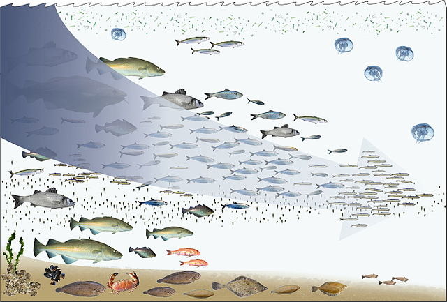
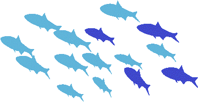
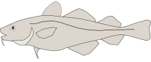
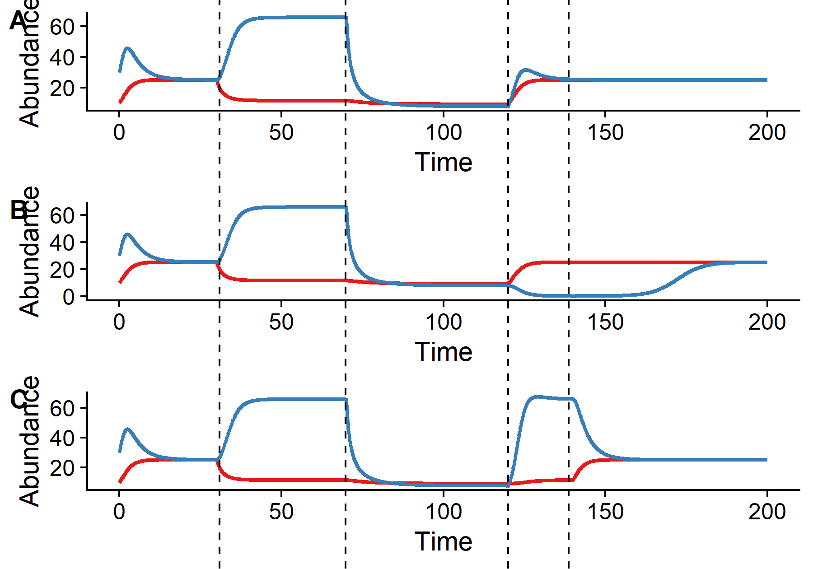
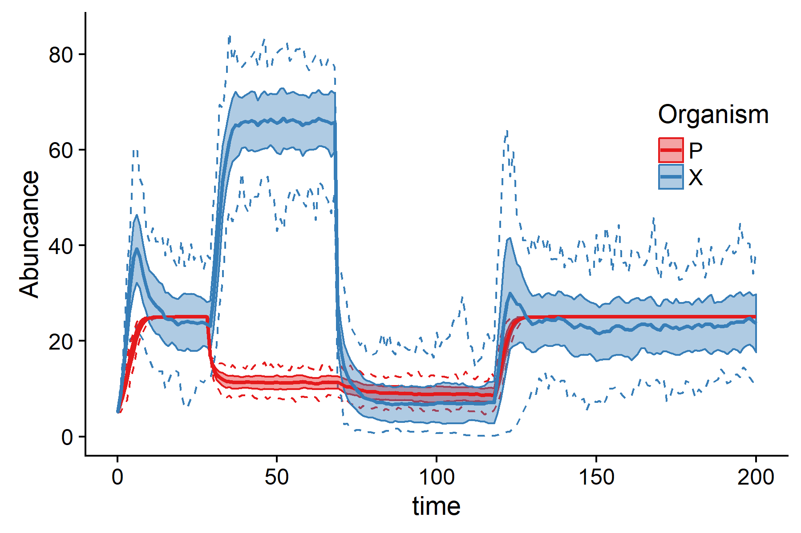

```{r setup, include=FALSE}
options(htmltools.dir.version = FALSE)
```

# The general idea



Pauly *et al.*, 1998 | © Hans Hillewaert, <a href="https://creativecommons.org/licenses/by-sa/4.0" title="Creative Commons Attribution-Share Alike 4.0">CC BY-SA 4.0</a>

---

class: inverse, center, middle

# How do rebuilding strategies shape the path of recovery?

---

# The model

From Samhouri *et al.*, 2017


\begin{split}
\frac{dX}{dt} &= r_xX\left(1-\frac{X}{K_x}\right)-a_xPX-h_xX \\
\frac{dP}{dt} &= [c(a_xX+a_yY)-d_P]P\left(1-\frac{P}{K_p}\right)-h_pP
\end{split}



---

# Strategy

- Run model until it reaches equilibrium without harvest

- Begin trophic downgrading (until equilibrium)

- Begin exploiting prey (until equilibrium)

- Start recovery:

  - Both

  - Predator first

  - Prey first
  
- Convert to discrete time and add stochastic version

---

# Different scenarios




---

# Discrete time - stochastic




